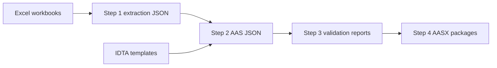

# excel-to-aasx

Excel-to-AASX generator for supplier workbook data.

The package reads configured `.xlsx` workbooks, preserves a neutral extraction
record, maps workbook rows into selected IDTA/Admin Shell submodel templates,
validates the generated AAS JSON, and writes AASX packages with review reports.

## Pipeline



## Inputs

```text
configs/companies/<company>.json
configs/formats/<format>.json
data/input/<company>/*.xlsx
third_party/admin-shell-io
third_party/aas-core-works/aas-core-schema/schema.json
```

## Outputs

```text
data/generated/<company>/xlsx-json-step1/
data/generated/<company>/xlsx-json-step2/
data/generated/<company>/xlsx-json-step3/
data/generated/<company>/xlsx-json-step4/
data/generated/<company>/aasx/
data/generated/<company>/logs/
```

Important review files:

```text
mapping-report.json
validation-report.json
review/<sheet>/unmapped-rows.json
review/<sheet>/preclassified-unmapped-rows.json
review/<sheet>/dummy-generated.json
review/<sheet>/matched-rows.json
summary.json
aasx/*.aasx
```

In Step 2 logs, `preclassified_unmapped_excel_row` is diagnostic only: the
first generic classifier did not directly place the row. `unresolved_excel_row`
is the important value: it counts rows still not placed after the full
transform. Review `unmapped-rows.json` for actual unresolved source data.

## Quickstart

Please refer to [docs/quickstart.md](docs/quickstart.md) for instructions on setting up your environment, preparing input data, and running the extraction pipeline.

## Documentation

* [docs/quickstart.md](docs/quickstart.md) - Instructions for setting up the environment and running the pipeline.
* [docs/architecture.md](docs/architecture.md) - Overview of the data flow and system design.
* [docs/limitations.md](docs/limitations.md) - Important limitations to review before treating generated output as reviewed product data.
* [docs/third-party.md](docs/third-party.md) - Information regarding third-party dependencies and schemas.
* [docs/README.md](docs/README.md) - Documentation index.
