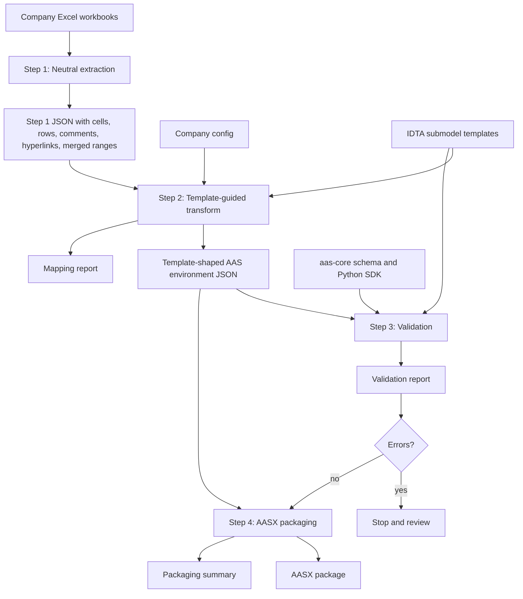
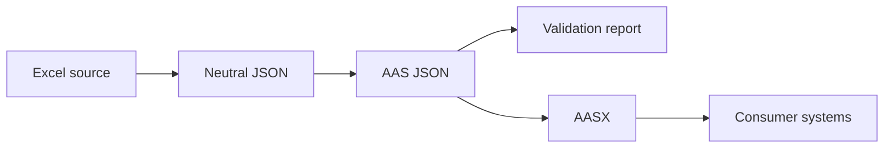

# Architecture

`excel-to-aasx` converts semi-structured supplier Excel workbooks into
auditable AAS JSON and AASX packages.

## Pipeline



## Stage Responsibilities

| Stage | Output | Responsibility |
| --- | --- | --- |
| Step 1 extraction | `xlsx-json-step1/` | Capture workbook content as reviewable neutral JSON |
| Step 2 transform | `xlsx-json-step2/` | Deep-copy official templates and fill values from extracted rows |
| Step 3 validation | `xlsx-json-step3/` | Check AAS schema, SDK verification, template shape, project rules |
| Step 4 package | `xlsx-json-step4/` | Write package-ready JSON and AASX, then roundtrip-read it |

## Artifact Flow



## Configuration Boundary

Company-specific input is declared in:

```text
configs/companies/<company>.json
```

The config selects:

- input workbook directory;
- expected workbook names;
- output root;
- AAS, asset, and submodel identifier prefixes;
- worksheet-to-template mappings.

The config does not modify upstream templates. It tells the pipeline which
official template each worksheet should instantiate.

## Evidence Model

The generator must never silently drop uncertainty. Review evidence is written
at each stage:

```text
xlsx-json-step1/
  complete workbook extraction

xlsx-json-step2/
  environment.json
  mapping-report.json

xlsx-json-step3/
  validation-report.json

xlsx-json-step4/
  environment.json
  *.aasx
  summary.json
```

Mapping and validation reports are part of the engineering output. They are how
a reviewer checks which rows were matched, skipped, expanded, or converted into
dummy values.
