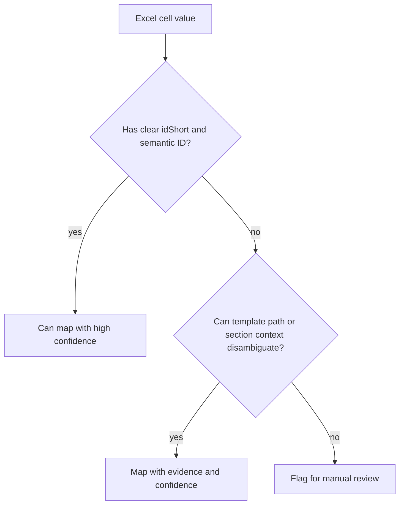

# Limitations

This project makes Excel-to-AASX generation reproducible and reviewable. It
does not make arbitrary spreadsheets semantically correct AAS instances.

## Strong Guarantees

The pipeline can guarantee:

- workbook content is extracted into stable JSON evidence;
- configured official templates are used as the structural source;
- generated AAS JSON is checked by schema and SDK validation;
- project rules reject known bad outputs such as parser metadata leakage;
- AASX packages are roundtrip-read before success is reported;
- mapping, validation, dummy-value, and packaging decisions are logged.

## Weak Guarantees

The pipeline cannot fully guarantee:

- every Excel row belongs to the chosen submodel;
- every visual section heading was interpreted correctly;
- every unit, value, file, image, and lifecycle field is business-correct;
- copied template rows in Excel represent real product data;
- a missing value should be empty, dummy-generated, or manually supplied;
- a UI visualization tab will render every valid AAS element.

## Why Full Automation Is Limited

Excel contains layout and presentation signals, not a formal AAS mapping. A
merged cell, color, blank row, or nearby heading can be meaningful to a human
while still being ambiguous to software.



## Dummy Values

Mandatory AAS fields sometimes have no Excel value. The pipeline may generate a
dummy value so the element remains visible and structurally valid.

Dummy values are marked with:

```text
SourceValueStatus = DummyGenerated
```

This is not real product data. It is a review signal.

## Supplementary Files

If Excel references a local image or PDF but the real file is not available,
the package step may add a placeholder supplementary file. This keeps AASX
packaging technically valid, but the placeholder is not a substitute for the
real document.

## Production Requirement

For production use, treat the generated reports as mandatory review artifacts.
High-confidence automation is acceptable only when:

- input workbook formats are controlled;
- template versions are pinned;
- mapping reports are reviewed;
- validation is clean;
- unresolved or low-confidence rows block release;
- accepted mappings become versioned configuration or tests.
