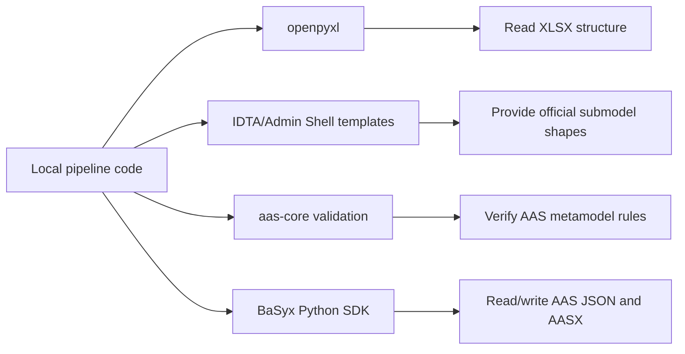

# Third-Party Dependencies

This project should not reimplement AAS standards or maintained parser/SDK
behavior. Third-party packages and submodules define the standard surfaces that
the local pipeline builds on.

## Why Third-Party Code Is Needed



Without these dependencies, this repo would need to maintain its own Excel
reader, IDTA template copies, AAS metamodel validator, and AASX packager. That
would increase review burden and risk divergence from maintained community
tools.

## Runtime Python Dependencies

| Dependency | Role |
| --- | --- |
| `openpyxl` | Reads XLSX workbooks, cells, formulas, comments, hyperlinks, merged ranges |
| `jsonschema` | Runs JSON Schema validation for generated AAS environments |
| `basyx-python-sdk` | Reads/writes AAS JSON and packages AASX files |
| `PyYAML` | Reserved for mapping/config formats if YAML mappings are introduced |
| `pytest` | Test runner for this package |

## Git Submodules

| Submodule | Role |
| --- | --- |
| `third_party/admin-shell-io/submodel-templates` | Official IDTA/Admin Shell submodel templates used as structure references |
| `third_party/aas-core-works/aas-core-codegen` | Generated AAS JSON Schema source used for schema validation |
| `third_party/aas-core-works/aas-core3.0-python` | Typed AAS V3.0 model deserialization and verification |

## Ownership Rule

Do not edit files inside `third_party/`. Project-specific behavior belongs in:

```text
configs/
excel_to_aasx/
tests/
docs/
```

If an upstream tool is missing a required feature, add a small local adapter and
document the gap instead of patching the submodule.
