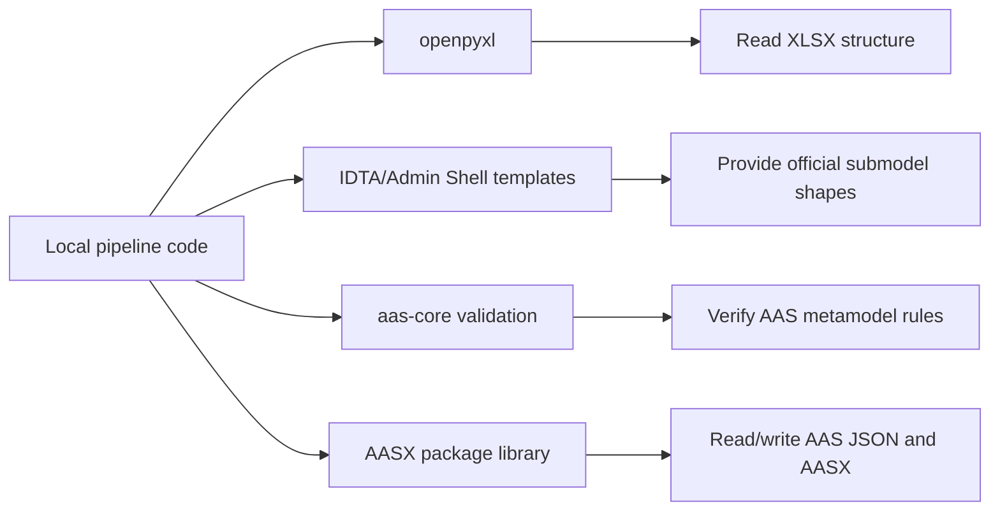

# Third-Party Dependencies

The generator uses a small set of external libraries and reference repositories
for workbook reading, template structure, AAS validation, and AASX packaging.

## Why Third-Party Code Is Needed



These dependencies keep the local code focused on extraction, mapping, and
evidence generation.

## Python Dependencies

| Dependency | Role |
| --- | --- |
| `openpyxl` | Reads XLSX workbooks, cells, formulas, comments, hyperlinks, merged ranges |
| `jsonschema` | Runs JSON Schema validation for generated AAS environments |
| `aas-core3.0` | Typed AAS V3.0 model deserialization and verification |
| `basyx-python-sdk` | Reads/writes AAS JSON and packages AASX files |
| `PyYAML` | Reserved for mapping/config formats if YAML mappings are introduced |
| `pytest` | Test runner for this package |

## External Reference Inputs

The official IDTA/Admin Shell templates are kept as a Git submodule so the
project can pin a known upstream revision while allowing that repository to be
updated independently. The AAS schema is kept as a small tracked artifact so
validation remains reproducible without cloning the complete generator
repository.

| Path | Source | Role |
| --- | --- |
| `third_party/admin-shell-io` | Git submodule `admin-shell-io/submodel-templates` at `b5fe9ae671520b87adc33c67c44ccdab4373c2b1` | Official IDTA/Admin Shell submodel templates used as structure references |
| `third_party/aas-core-works/aas-core-schema/schema.json` | Generated by `aas-core-works/aas-core-codegen` at `e1de3f45216ce8b5dd116367a8668dd7f9e29a9a` | Generated AAS JSON Schema used for validation |

The schema artifact was generated from `aas-core-meta` commit
`f1d97f60b34d2dc97a8004ccfb3fc28487b91c7a`, as recorded by the upstream
`aas-core-codegen` test data.

Detailed provenance is tracked in:

```text
third_party/references.lock.json
third_party/admin-shell-io/PROVENANCE.md
third_party/aas-core-works/aas-core-schema/PROVENANCE.md
```

## Git Submodules

The repository has one direct submodule:

```bash
git submodule update --init --recursive
```

The `--recursive` flag is future-proof if the upstream template repository
introduces submodules of its own.

## Local Ownership

Project-specific behavior belongs in:

```text
configs/
excel_to_aasx/
tests/
docs/
```

Vendored third-party contents are treated as reference inputs. Local adapters
should stay outside `third_party/`.
